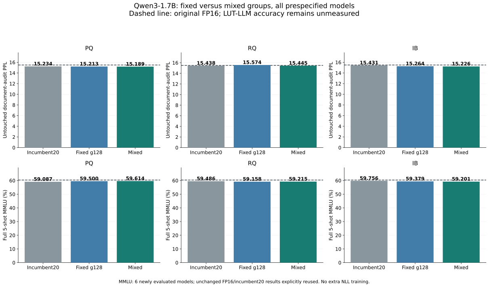

# TTA

A hardware–software co-design project for LLM inference on accelerators built with **3D gain-cell
memory**.

3D gain cells are compact, low-leakage DRAM-like bit cells that can be stacked above the logic in
back-end-of-line layers. They are far denser than SRAM while keeping SRAM-like access latency, so an
accelerator can carry one to two orders of magnitude more on-chip memory than today.

For the purposes of this project, the hardware is abstracted as **a GPU with a much larger SRAM**.
The software question we study is how LLM inference should be restructured to exploit that
capacity: keeping weights and KV cache on chip, trading arithmetic for lookup tables, and choosing
quantisation and table formats against an explicit on-chip memory budget.

## Lookup tables as the key approach

A lookup table (LUT) replaces computation with memory: results are precomputed once, stored, and
retrieved by index at run time. For LLM inference the relevant case is the linear layer. If weights
are quantised to a small set of values, or activations and weights are both mapped to codebooks,
then the partial dot products between an input pattern and a group of weights can be tabulated in
advance. Inference then becomes a sequence of table reads and additions rather than multiplies.

This trade is unattractive on conventional hardware because the tables are large and on-chip
memory is scarce, so lookups spill into slow off-chip DRAM. Dense 3D gain-cell memory removes that
constraint: tables that would not fit in SRAM today can stay on chip, and the memory itself becomes
the compute substrate. LUT-based inference is therefore the central technique this project builds
on. The main design questions are how to form the tables (bit-plane partial sums, vector-quantised
codebooks, or hybrids), how large they must be to preserve accuracy, and how many lookups and
additions each token costs under a given on-chip memory budget.

## Reporting efficiency

Unless stated otherwise, the efficiency of any method in this project is reported as three operation
counts, measured per generated token over the whole model:

- **Lookups**: number of table reads.
- **Additions**: number of integer or floating-point additions, including accumulation of partial
  sums.
- **Multiplications**: number of multiplications, including any scaling or dequantisation steps.

Counts are reported alongside the on-chip memory the method needs (tables, codebooks, weight
indices and scales) and its accuracy, so that every result can be read as an accuracy–memory–
operation trade-off. Wall-clock timings on GPUs are supplementary and do not replace these counts.

Every new method comparison uses the eight columns shown below and includes **FP16 dense, the LUT-LLM baseline,
and the current method** together. Report FPGA operation costs or a clearly labelled reference
weighted score alongside them. State precision, memory placement, access width and reuse assumptions;
distinguish estimates from synthesis results and hardware measurements. Missing measurements remain
unmeasured.

New accuracy reports also include **MMLU accuracy**, with the shot count, prompt format,
number of evaluated questions, and scoring rule stated explicitly. Round 18 uses all 57 subjects,
14,042 test questions, five development examples per subject, and raw A/B/C/D continuation
likelihood (no chat template or generated reasoning). MMLU test results are an audit after model
selection, not a tuning signal for that round. Unmeasured LUT-LLM accuracy remains unmeasured.

Report pure PTQ and additional WikiText NLL adaptation separately. An adapted quantized model
must be compared with a control that adapts the original FP16 weights using the same data,
number of group parameters, update budget and checkpoint-selection budget. Lower PPL than an
unadapted FP16 model alone is not evidence that quantization improves the model. Record the
training/monitor/audit split and distinguish reused WikiText test results from fresh audit data.

<!-- ROUND22_PRELIMINARY_START -->
## Qwen3-1.7B: shared-table mappings (preliminary, round 22)

As of 2026-10-08 20:06 UTC, all nine PQ/RQ/IB banks (global, projection-specific and layer-specific offline mappings) have completed packed CPU and GPU numerical verification: 1,764 layer checks and exact short calibration comparisons. Each deployed bank uses one shared table. **New holdout PPL and MMLU have not been measured.** TRAIN distortion is a fitting diagnostic and is not an accuracy result. The latest completed accuracy comparison remains round 21 below.

[Preliminary report](pq_exploration/study_1p7b_20261008_types22/REPORT22_PRELIMINARY_ZH.txt) · [TRAIN diagnostics](pq_exploration/study_1p7b_20261008_types22/shared_maps22_cpu.json) · [GPU verification summary](pq_exploration/study_1p7b_20261008_types22/local_shared_maps22_gpu_verified.json)
<!-- ROUND22_PRELIMINARY_END -->

<!-- ROUND21_MIXED_START -->
## Qwen3-1.7B: mixed groups with document-level holdouts

Each of PQ, additive RQ and entropy-regularized IB compares a matched 24-update fixed-g128 fit with a TRAIN-only mixed-g64/g128 fit and the round20 incumbent. All are pure PTQ, with no extra NLL training. All nine quantized banks pass the lookup, arithmetic (including reciprocals), and resident-memory constraints.

The prescoring document audit found 61 eligible untouched articles, so 30 monitor and 30 audit articles were fixed before any new21 scoring; the remaining article was unused. Each article contributes one 2048-token window. Rankings were frozen on monitor NLL, and all ten models received final PPL audits irrespective of ranking.

| Method | Lookups | Additions | Multiplications | On-chip memory | PPL | MMLU | E_ref (mJ/token) |
|---|---:|---:|---:|---:|---:|---:|---:|
| fp16 | 0.000 M | 1408.713 M | 1409.286 M | 2688.000 MiB | 16.669954 | 60.348%（复用） | 2.395557 |
| LUT-LLM | 704.643 M | 726.663 M | 0.573 M | 1764.000 MiB | 未测量 | 未测量 | 2.969054 |
| pq_incumbent20 | 704.643 M | 704.987 M | 12.100 M | 1269.470 MiB | 16.458401 | 59.087%（复用） | 2.975368 |
| pq_fixed_g128 | 704.643 M | 704.987 M | 12.100 M | 1269.470 MiB | 16.451318 | 59.500% | 2.975368 |
| pq_mixed | 704.643 M | 705.053 M | 13.836 M | 1273.157 MiB | 16.469460 | 59.614% | 2.977652 |
| rq_incumbent20 | 704.643 M | 704.987 M | 12.100 M | 1606.976 MiB | 16.647492 | 59.486%（复用） | 2.975368 |
| rq_fixed_g128 | 704.643 M | 704.987 M | 12.100 M | 1269.470 MiB | 16.743327 | 59.158% | 2.975368 |
| rq_mixed | 704.643 M | 705.151 M | 14.541 M | 1274.501 MiB | 16.600685 | 59.215% | 2.978607 |
| ib_incumbent20 | 704.643 M | 704.987 M | 12.100 M | 1497.471 MiB | 16.618192 | 59.756%（复用） | 2.975368 |
| ib_fixed_g128 | 704.643 M | 704.987 M | 12.100 M | 1269.470 MiB | 16.514785 | 59.379% | 2.975368 |
| ib_mixed | 704.643 M | 705.610 M | 21.095 M | 1287.001 MiB | 16.374142 | 59.201% | 2.987311 |

Matched mixed versus fixed-g128 fits:
- **PQ**: TEST PPL +0.110%; document-audit PPL -0.156% (paired approximate 95% interval [-0.437%, +0.125%]); MMLU +0.114 percentage points.
- **RQ**: TEST PPL -0.852%; document-audit PPL -0.828% (paired approximate 95% interval [-1.154%, -0.500%]); MMLU +0.057 percentage points.
- **IB**: TEST PPL -0.852%; document-audit PPL -0.247% (paired approximate 95% interval [-0.684%, +0.192%]); MMLU -0.178 percentage points.

MMLU is full 57-subject, 14,042-question, raw five-shot A/B/C/D continuation likelihood, with no chat template or generated reasoning. All six new banks are newly evaluated. FP16 and the three unchanged round20 models explicitly reuse their historical MMLU; bank bytes, request bytes, scoring functions, numerical source dependencies and saved labels are checked, and their complete TEST PPL is exactly reproduced. These four MMLU rows are not fresh measurements.
PPL uses WikiText-2 raw TEST with 2048-token nonoverlapping contexts and 298,862 scored tokens. Document-monitor and document-audit sets each contain 61,410 scored tokens. Entire selected top-level WikiText articles avoid recorded18–20 training, calibration, monitor and audit ranges; exact titles are unique. Semantic duplicates, unrecorded earlier uses and model pretraining are not decontaminated. Historical TEST and MMLU remain repeatedly observed benchmarks.
Operation counts are millions per generated token over the same196 decoder linears. Embeddings, LM head, QK/AV, normalization and nonlinearities are excluded in every row. W8A9 uses shared resident INT32 dot tables, FP16 scales and FP32 accumulation. Memory includes packed indices, tables, scales, codebooks and single-token scratch. All quantized rows have516,292 additional reciprocals/token, already included in the strict arithmetic gate.
New RQ retains15+32 additive components and clipping-aware backfitting; the old conditional RQ has independently refinable centers and is a different model family variant. New IB minimizes local distortion plus entropy with a fixed normalization and480 stored centers; it neither measures full-model mutual information nor compresses index width based on entropy.
E_ref=(3.8L+0.4A+1.3M)/1e9 is a7nm logical reference score, not FPGA synthesis or measured energy. LUT-LLM is a same-shape resource reference with accuracy unmeasured. One calibration setting and one document split do not establish that all overfitting has been removed. At most two study GPUs run concurrently, with four CPU threads per worker.



[Chinese report](pq_exploration/study_1p7b_20261008_mixed21/REPORT21_ZH.txt) · [Full results](pq_exploration/study_1p7b_20261008_mixed21/round21_summary.json) · [Protocol](pq_exploration/study_1p7b_20261008_mixed21/protocol21.json) · [Local verification](pq_exploration/study_1p7b_20261008_mixed21/local_import21_evidence.json)
<!-- ROUND21_MIXED_END -->

<!-- ROUND20_CAPACITY_START -->
## Qwen3-1.7B: resource-constrained pure-PTQ capacity study

Seventeen fixed W8A9/g128 candidates compare four flat-PQ capacities, six residual-quantization configurations and seven entropy-regularized IB approximations. Every candidate passes the strict lookup, arithmetic and resident-memory limits versus the same-shape LUT-LLM resource baseline. Each family is selected by the lowest NLL on all 32 new monitor windows, with memory and name used only to break ties. The three selected models and original FP16 are frozen before final audit PPL, WikiText TEST or MMLU. There is no NLL adaptation in this study.

| Method | Lookups | Additions | Multiplications | On-chip memory | PPL | MMLU | E_ref (mJ/token) |
|---|---:|---:|---:|---:|---:|---:|---:|
| fp16 | 0.000 M | 1408.713 M | 1409.286 M | 2688.000 MiB | 16.669954 | 60.348% | 2.395557 |
| LUT-LLM | 704.643 M | 726.663 M | 0.573 M | 1764.000 MiB | 未测量 | 未测量 | 2.969054 |
| pq_k480 | 704.643 M | 704.987 M | 12.100 M | 1269.470 MiB | 16.458401 | 59.087% | 2.975368 |
| rq_32x32_conditional | 704.643 M | 704.987 M | 12.100 M | 1606.976 MiB | 16.647492 | 59.486% | 2.975368 |
| ib_k768_l0.8 | 704.643 M | 704.987 M | 12.100 M | 1497.471 MiB | 16.618192 | 59.756% | 2.975368 |

- **PQ** (pq_k480): TEST PPL -1.269%, fresh-audit PPL -0.913% relative to FP16; MMLU -1.261 percentage points, paired approximate 95% interval [-1.699, -0.822].
- **RQ** (rq_32x32_conditional): TEST PPL -0.135%, fresh-audit PPL -0.560% relative to FP16; MMLU -0.862 percentage points, paired approximate 95% interval [-1.266, -0.458].
- **IB** (ib_k768_l0.8): TEST PPL -0.311%, fresh-audit PPL -0.123% relative to FP16; MMLU -0.591 percentage points, paired approximate 95% interval [-0.987, -0.196].

PPL uses WikiText-2 raw TEST, 2048-token nonoverlapping contexts and 298,862 scored tokens. The new monitor and audit each contain 32 windows and exclude earlier holdout/training windows by token position. They are not document-level or pretraining-decontaminated holdouts. Historical TEST and MMLU have been inspected in prior rounds; this is a new frozen selection within an iterative study, not a fully unseen benchmark.
MMLU uses all 57 subjects and 14,042 test questions, the first five dev examples per subject, raw single-token A/B/C/D continuation likelihood and FP32 log-softmax. There is no chat template, generated reasoning, context truncation or shared-prefix reuse. Saved answer labels and ordering are checked directly against the immutable request data.
Counts are millions per generated token across the same 196 decoder linears, with shared embeddings, LM head, QK/AV, norms and nonlinearities excluded. W8A9 tables store INT32 dot products; scales are FP16 and accumulation is FP32. Resident memory includes shared tables, packed indices, codebooks, scales and peak single-token linear scratch. Logical lookup counts are distinct from physical memory transactions. RQ centers are composed offline, so inference retains one lookup per weight pair.
All quantized rows have 516,292 additional reciprocals/token; the arithmetic gate conservatively includes them. E_ref=(3.8L+0.4A+1.3M)/1e9 is a uniform 7 nm reference score, not FPGA synthesis or measured energy. LUT-LLM accuracy remains unmeasured; its row is a same-shape resource baseline, not a reproduction of paper QAT.
IB uses a local activation-distortion plus entropy objective with covariance compensation; this is not a measurement of whole-model mutual information. The fixed single-seed grid and lower PPL do not establish that all overfitting has been removed. All 17 candidate banks and monitor records, including non-winners, are retained. At most two study GPUs run concurrently, with four CPU threads per worker.

[Chinese report and all candidate rankings](pq_exploration/study_1p7b_20261008_ops20/REPORT20_ZH.txt) · [Full results](pq_exploration/study_1p7b_20261008_ops20/round20_summary.json) · [Frozen selections](pq_exploration/study_1p7b_20261008_ops20/overfit20_frozen.json) · [Local verification](pq_exploration/study_1p7b_20261008_ops20/local_import20_evidence.json)
<!-- ROUND20_CAPACITY_END -->

<!-- ROUND19_TRANSFER_START -->
## Qwen3-1.7B transfer and full MMLU audit

The three recipes were fixed before any 1.7B accuracy results. Codebooks, activation statistics, packed indices and all ten adaptation trajectories were fitted anew. All checkpoint choices were frozen on a new monitor before final PPL and MMLU. Calibration used A6000 GPUs; all ten final training trajectories and final evaluations used two A100 GPUs, with four CPU threads per worker. The earlier A6000 trial runs were retained and excluded from final selection; migration was based on synthetic speed measurements.

| Method | Lookups | Additions | Multiplications | On-chip memory | PPL | MMLU | E_ref (mJ/token) |
|---|---:|---:|---:|---:|---:|---:|---:|
| FP16 原始 | 0.000 M | 1408.713 M | 1409.286 M | 2688.000 MiB | 16.669954 | 60.348% (8474/14042) | 2.395557 |
| FP16 g128 + NLL | 0.000 M | 1408.713 M | 1409.286 M | 2688.000 MiB | 10.665211 | 59.942% (8417/14042) | 2.395557 |
| FP16 g128 + NLL + KL | 0.000 M | 1408.713 M | 1409.286 M | 2688.000 MiB | 11.592167 | 60.376% (8478/14042) | 2.395557 |
| FP16 g64 + NLL | 0.000 M | 1408.713 M | 1409.286 M | 2688.000 MiB | 10.651896 | 60.412% (8483/14042) | 2.395557 |
| FP16 g64 + NLL + KL | 0.000 M | 1408.713 M | 1409.286 M | 2688.000 MiB | 11.513327 | 60.212% (8455/14042) | 2.395557 |
| LUT-LLM 形状资源基准 | 704.643 M | 726.663 M | 0.573 M | 1764.000 MiB | 未同协议测量 | 未测量 | 2.969054 |
| PQ 纯 PTQ | 704.643 M | 704.987 M | 12.100 M | 1269.470 MiB | 16.458401 | 59.087% (8297/14042) | 2.975368 |
| PQ NLL | 704.643 M | 704.987 M | 12.100 M | 1269.470 MiB | 10.755841 | 59.742% (8389/14042) | 2.975368 |
| PQ NLL + KL | 704.643 M | 704.987 M | 12.100 M | 1269.470 MiB | 11.612263 | 59.258% (8321/14042) | 2.975368 |
| RQ 纯 PTQ | 704.643 M | 705.905 M | 23.110 M | 1289.595 MiB | 16.750784 | 59.493% (8354/14042) | 2.990048 |
| RQ NLL | 704.643 M | 705.905 M | 23.110 M | 1289.595 MiB | 10.764416 | 59.949% (8418/14042) | 2.990048 |
| RQ NLL + KL | 704.643 M | 705.905 M | 23.110 M | 1289.595 MiB | 11.551488 | 59.813% (8399/14042) | 2.990048 |
| IB 纯 PTQ | 704.643 M | 705.905 M | 23.110 M | 1348.096 MiB | 16.588306 | 59.614% (8371/14042) | 2.990048 |
| IB NLL | 704.643 M | 705.905 M | 23.110 M | 1348.096 MiB | 10.719365 | 59.870% (8407/14042) | 2.990048 |
| IB NLL + KL | 704.643 M | 705.905 M | 23.110 M | 1348.096 MiB | 11.517881 | 59.792% (8396/14042) | 2.990048 |

Counts are millions of operations per generated token over all 196 decoder linears. PPL uses WikiText-2 raw TEST with 2048-token nonoverlapping contexts. MMLU uses all 57 subjects and 14,042 test questions, five dev examples, raw A/B/C/D likelihood, no chat template or generated reasoning. It did not select checkpoints.

- **PQ**: NLL+KL PPL versus matched NLL+KL FP16 changes by +0.173% on TEST and +0.173% on the new audit. KL versus NLL MMLU changes by -0.484 percentage points (paired approximate 95% interval [-0.878, -0.090]).
- **RQ**: NLL+KL PPL versus matched NLL+KL FP16 changes by +0.331% on TEST and +0.366% on the new audit. KL versus NLL MMLU changes by -0.135 percentage points (paired approximate 95% interval [-0.516, +0.245]).
- **IB**: NLL+KL PPL versus matched NLL+KL FP16 changes by +0.040% on TEST and +0.034% on the new audit. KL versus NLL MMLU changes by -0.078 percentage points (paired approximate 95% interval [-0.464, +0.308]).

Arithmetic-budget failures are retained: the transferred g64 RQ/IB configurations exceed the recomputed same-shape LUT-LLM additions+multiplications budget by about 0.32% when reciprocals are included. PQ passes that resource gate. A passing PPL result alone does not establish that every resource requirement passes.
LUT-LLM is a shape-based resource reference, not a reproduction of paper QAT accuracy. E_ref=(3.8L+0.4A+1.3M)/1e9 is a uniform 7 nm logical proxy, not measured FPGA energy. Quantized rows have 516,292 additional reciprocals/token. Resident memory is distinct from GPU training memory or streamed FPGA buffers.
Matched FP16 controls have the same data, bounded group-gain parameter count, optimizer and checkpoint-selection budget. Do not attribute gains over unadapted FP16 to quantization. One seed, one KL coefficient and within-corpus token-disjoint holdouts do not prove that all overfitting is eliminated.

[Chinese report](pq_exploration/study_1p7b_20261007_a100/REPORT19_ZH.txt) · [Full results](pq_exploration/study_1p7b_20261007_a100/round19_summary.json) · [Frozen selections](pq_exploration/study_1p7b_20261007_a100/overfit19_frozen.json) · [Independent aggregate audit](pq_exploration/study_1p7b_20261007_a100/round19_integrity_audit.json)
<!-- ROUND19_TRANSFER_END -->

<!-- ROUND18_AUDIT_START -->
## Overfitting correction and full MMLU audit (2026-10-07)

This audit separates pure PTQ, WikiText NLL adaptation, and adaptation with a fixed original-FP16 teacher KL penalty (coefficient 1, temperature 1). Matched FP16 controls use the same training data, number of bounded group gains, update budget, and checkpoint-selection budget. Gains are merged offline into FP16 weights for inference.

Training uses 128 fixed 512-token windows, four-window accumulation, at most 256 Adam updates, and scales bounded within 2% of their immutable pre-adaptation values. Checkpoints were selected on a new token-disjoint monitor and frozen before final PPL or MMLU. All ten adapted trajectories selected update 256; early stopping did not trigger.

PPL below is WikiText-2 raw TEST with 2048-token nonoverlapping contexts and 298,862 scored tokens. MMLU is all 57 subjects and 14,042 test questions, five first-dev examples per subject, raw A/B/C/D continuation likelihood, no chat template or generated reasoning, and micro accuracy. This differs from advertised thinking-mode results.

| Method | Lookups | Additions | Multiplications | On-chip memory | PPL | MMLU | E_ref (mJ/token) |
|---|---:|---:|---:|---:|---:|---:|---:|
| FP16 dense / unadapted | 0.000 M | 440.000 M | 440.000 M | 840.000 MiB | 20.955240 | 47.358% | 0.748000 |
| FP16 g128 / NLL | 0.000 M | 440.000 M | 440.000 M | 840.000 MiB | 15.424360 | 47.465% | 0.748000 |
| FP16 g128 / NLL + KL(1) | 0.000 M | 440.000 M | 440.000 M | 840.000 MiB | 16.561121 | 47.572% | 0.748000 |
| FP16 g64 / NLL | 0.000 M | 440.000 M | 440.000 M | 840.000 MiB | 15.336974 | 47.465% | 0.748000 |
| FP16 g64 / NLL + KL(1) | 0.000 M | 440.000 M | 440.000 M | 840.000 MiB | 16.456379 | 47.507% | 0.748000 |
| LUT-LLM shape/PTQ resource baseline | 220.201 M | 233.000 M | 0.300 M | 574.000 MiB | Unmeasured | Unmeasured | 0.930354 |
| PQ / pure PTQ | 220.201 M | 220.086 M | 4.072 M | 561.737 MiB | 20.998280 | 46.810% | 0.930091 |
| PQ / NLL | 220.201 M | 220.086 M | 4.072 M | 561.737 MiB | 15.707199 | 46.909% | 0.930091 |
| PQ / NLL + KL(1) | 220.201 M | 220.086 M | 4.072 M | 561.737 MiB | 16.781400 | 47.094% | 0.930091 |
| RQ / pure PTQ | 220.201 M | 220.316 M | 7.512 M | 512.144 MiB | 20.961429 | 47.109% | 0.934656 |
| RQ / NLL | 220.201 M | 220.316 M | 7.512 M | 512.144 MiB | 15.551077 | 47.002% | 0.934656 |
| RQ / NLL + KL(1) | 220.201 M | 220.316 M | 7.512 M | 512.144 MiB | 16.604509 | 47.144% | 0.934656 |
| IB / pure PTQ | 220.201 M | 220.316 M | 7.512 M | 569.145 MiB | 20.934607 | 47.522% | 0.934656 |
| IB / NLL | 220.201 M | 220.316 M | 7.512 M | 569.145 MiB | 15.452445 | 47.251% | 0.934656 |
| IB / NLL + KL(1) | 220.201 M | 220.316 M | 7.512 M | 569.145 MiB | 16.532575 | 47.614% | 0.934656 |

Measured effects of the fixed KL penalty:

- **PQ**: PPL 15.7072 → 16.7814; MMLU 46.909% → 47.094% (+0.185 percentage points; paired approximate 95% interval [-0.233, +0.603]). Regularized PPL is +1.330% relative to its matched regularized FP16 control.
- **RQ**: PPL 15.5511 → 16.6045; MMLU 47.002% → 47.144% (+0.142 percentage points; paired approximate 95% interval [-0.275, +0.560]). Regularized PPL is +0.900% relative to its matched regularized FP16 control.
- **IB**: PPL 15.4524 → 16.5326; MMLU 47.251% → 47.614% (+0.363 percentage points; paired approximate 95% interval [-0.061, +0.787]). Regularized PPL is +0.463% relative to its matched regularized FP16 control.

**Do not attribute gains over unadapted FP16 to quantization.** The matched controls expose the benefit of extra WikiText training. Historical WikiText TEST has been reused; new monitor/audit windows are token-disjoint within this study, not document-disjoint or pretraining-decontaminated. MMLU did not choose checkpoints or the KL strength. One seed and one fixed KL strength do not establish that all overfitting is eliminated.

Counts cover the same 196 decoder linears per generated token; M=10^6. Common embeddings, LM head, QK/AV, norms and nonlinearities are excluded. FP16 counts are rounded. PQ uses W8A9/g128/K480/12-bit indices/INT32 tables; RQ uses W7A9/g64/630 offline-fused residual centers/13-bit indices/INT16 tables; IB uses W7A9/g64/K858/covariance-compensated assignments/13-bit indices/INT16 tables. Scales are FP16 and accumulation is FP32. Scale adaptation changes neither deployed operation counts nor resident memory.

`E_ref=(3.8*lookups+0.4*additions+1.3*multiplications)/1e9` is a uniform 7 nm logical reference score, **not measured FPGA energy**. Each quantized row also has 286,916 reciprocals/token, optionally adding 0.000372991 mJ/token at the multiplication coefficient. Index/scale reads and bit/address logic are separate from dot-table lookups. LUT-LLM is a resource baseline, not a reproduction of paper QAT accuracy.

Training used one GPU; final large evaluations used at most two GPUs on scai4, with four CPU threads per worker. FP16 controls were subsequently consolidated onto one GPU. All 196 actual packed layer outputs and short packed/reference PPL were checked before full PPL; MMLU scoring was checked against standard HFLM on validation fixtures. The numerically equivalent fused evaluation backend and original partial results are retained for audit.

Evidence: [Chinese report](pq_exploration/study_20261006/PHASE18_REPORT_ZH.txt), [full report](pq_exploration/study_20261006/PHASE18_REPORT.txt), [machine-readable results](pq_exploration/study_20261006/round18_summary.json), [frozen model choices](pq_exploration/study_20261006/overfit18_frozen.json), and [independent result audit](pq_exploration/study_20261006/round18_integrity_audit.json).
<!-- ROUND18_AUDIT_END -->

## Results (historical, 256-token contexts)

Qwen3-0.6B, all 196 decoder linears, counts per generated token. Perplexity on WikiText-2 (256-token
contexts). INT8 per-token activations throughout.

| Method | Lookups | Additions | Multiplications | On-chip memory | PPL |
|---|---:|---:|---:|---:|---:|
| FP16 dense | 0 | 440 M | 440 M | 840 MiB | 42.51 |
| W8A8 dense | 0 | 440 M | 441 M | 420 MiB | 43.90 |
| Bit-plane table, g=4, INT16 | 881 M | 881 M | 0.9 M | 3 361 MiB | 43.90 |
| Bit-plane table, g=5, INT8 | 705 M | 705 M | 706 M | 3 028 MiB | 43.69 |
| Bit-plane table, g=8, full | 440 M | 440 M | 0.9 M | 13 440 MiB | 43.90 |
| Bit-plane table, g=8, top-64 entries | 236 M | 733 M | 0.9 M | 6 720 MiB | 43.90 |
| Joint activation–weight VQ, v=2 (PTQ) | 220 M | 233 M | 0.3 M | 574 MiB | 1.2 × 10^7 |
| Joint activation–weight VQ, v=4 (PTQ) | 110 M | 123 M | 0.3 M | 312 MiB | 5.1 × 10^8 |

## PQ validation and reference weighted cost (2026-10-06)

This validation covers **Qwen3-0.6B only**, with at most **two GPUs running concurrently**.
The accuracy requirement is a **relative WikiText-2 PPL increase of at most 3%** versus FP16
under the same evaluation protocol.

The current method is weight-only symmetric product quantisation: disjoint 2D weight vectors,
K=2048 shared representative centroids, sign/swap symmetry, 14-bit indices per weight pair,
FP16 scales per row and 128 weights, and per-token INT8 activations. Precomputed dot products
are stored as INT16 table entries. No activation VQ or online nearest-centroid search is used.

Counts below cover all 196 decoder linears per generated token; M means one million. Embedding,
LM head, attention QK/AV, normalisation and nonlinear operations are excluded equally. PPL uses
WikiText-2 raw test, 2048-token non-overlapping complete contexts and 298,862 scored tokens.
These PPL values must not be compared directly with the historical 256-token results above.

| Method | Lookups | Additions | Multiplications | On-chip memory | PPL | Reference weighted score (mJ/token) |
|---|---:|---:|---:|---:|---:|---:|
| FP16 dense | 0 | 440 M | 440 M | 840 MiB | 20.955169 | 0.748000 |
| LUT-LLM shape baseline, v=2 | 220.201 M | 233 M | 0.300 M | 574 MiB | Not evaluated under this protocol | 0.930354 |
| Symmetric PQ, K=2048 | 220.201 M | 220.086 M | 4.072 M | 502.237 MiB | 21.386942 (+2.06%) | 0.930091 |

The LUT-LLM row uses this project's joint activation–weight VQ resource baseline
(v=2, Ca=64, Cw=16, G=512). It is not a reproduction of the original paper's QAT accuracy.
The memory column retains the project's whole-model resident-storage convention, including
compressed weights, tables and scales; the PQ audit also includes peak linear scratch space.
It does not represent the streamed on-chip buffer capacity of a deployed FPGA.

PQ passes the 3% PPL requirement: its relative increase is 2.06046%, below the absolute PPL
limit of 21.583824. PPL was measured with reconstructed quantised weights as a numerical reference.
The actual compressed lookup kernel was checked separately on all 196 linears and a short-text
consistency run; the full PPL evaluation was not rerun through that kernel.

### Reference cost calculation

Use the author's workshop illustration: **3.8 pJ per lookup, 0.4 pJ per FP32 addition and
1.3 pJ per FP32 multiplication**. These are **7 nm reference values, not measured V80 FPGA
operation energies**. Here they are applied uniformly as a logical-operation score, even though
the methods use different precisions.

```text
E_ref (pJ/token) = 3.8 * N_lookup + 0.4 * N_add + 1.3 * N_mul
E_ref (mJ/token) = E_ref (pJ/token) / 1,000,000,000

FP16:    (0 + 0.4*440,000,000 + 1.3*440,000,000) / 1e9 = 0.748000000
LUT-LLM: (3.8*220,200,960 + 0.4*233,000,000 + 1.3*300,000) / 1e9
         = 0.930353648
PQ:      (3.8*220,200,960 + 0.4*220,086,272 + 1.3*4,071,620) / 1e9
         = 0.836763648 + 0.088034509 + 0.005293106
         = 0.930091263
```

PQ also performs 286,916 reciprocals per token, listed separately from multiplications. If each
reciprocal is provisionally charged at the multiplication coefficient, add 0.000372991 mJ/token:
the PQ score becomes **0.930464254 mJ/token**, approximately **0.012% above LUT-LLM**.
Without that allowance it is approximately 0.028% below LUT-LLM. The baseline arithmetic counts
are rounded, so both differences should be interpreted as **effectively equal**, not as an energy
advantage. The reciprocal allowance is an assumption, not a measured cost or an energy upper bound.

Lookup contributes about 90% of the PQ score. Fewer additions save about 0.005165 mJ/token,
while extra multiplications add about 0.004903 mJ/token, almost cancelling the saving.

This score is **not a ranking of actual FPGA energy**. In particular, dense weight/activation reads
are not included, and the common coefficients do not account for operation precision, table size,
physical access width, row reuse, routing or static power. LUT-LLM can read a row and reuse it through
multiplexers, so one logical lookup need not equal one SRAM transaction. FPGA energy comparisons
require a matched implementation and memory-access model or hardware measurements.

Sources:

- [LUT-LLM paper, Sections II-C and IV-C](https://arxiv.org/html/2511.06174v2)
- [Jason Cong workshop slides, page 8: reference energy illustration](https://publish.illinois.edu/ai-hw-workshop/files/2026/01/jason_cong.pdf#page=8)
- [Jouppi et al., ISCA 2021, Table 2: underlying 7 nm operation energies](https://parsa.epfl.ch/course-info/cs723/papers/tpuv4i.pdf#page=3)
  (The source's SRAM energies are per 64-bit access.)

## Cluster usage limits

- Per user, use at most **2 GPUs total across scai3–5** and **2 GPUs total across scai6–7**, counting all projects and jobs.
- Before exceeding either limit, post the **reason, GPU count and server(s), and duration** in `#scai-servers`. Unannounced excess jobs may be killed without warning; exceptions are handled case by case.
- Connect through VPN. Check CPU/GPU usage with `htop` and `nvidia-smi` before launching; never use a GPU occupied by another user.
- Select GPUs explicitly with `CUDA_VISIBLE_DEVICES` and limit CPU threads, e.g. `OMP_NUM_THREADS=4`. Run CPU-heavy jobs on scai1–5, not scai6–7.
- Consolidate jobs that each use **less than 50% of GPU memory** onto one GPU, accounting for peak memory needs.
- Monitor running jobs regularly and release memory when finished, including Jupyter kernels.
